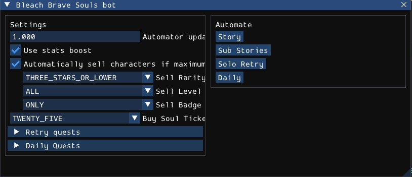

<div align="center">

# Bleach Brave Souls Bot

[](https://github.com/Blowerlop/Bleach-Brave-Souls-Bot/releases/latest)
[](https://github.com/Blowerlop/Bleach-Brave-Souls-Bot/releases/latest)
[](https://github.com/Blowerlop/Bleach-Brave-Souls-Bot/releases)
[](https://github.com/Blowerlop/Bleach-Brave-Souls-Bot/actions/workflows/windows.yml)
[](https://github.com/Blowerlop/Bleach-Brave-Souls-Bot/commits/main)
[](LICENSE)


[Requirements](#requirements) · [Download](#download) · [Quick start](#quick-start) · [Features](#features) · [Build from source](#build-from-source)



</div>

---

## About

Bleach Brave Souls asks for a lot of repetitive tapping: clearing story chapters, sub stories, daily quests, replaying the same quest over and over. This bot does that tapping for you.

## Requirements

- Windows 10 or 11, 64 bit
- A graphics card and driver with Vulkan support
- Bleach Brave Souls game
- The game resolution set to **1600x900**
- The game set to **English**

> [!IMPORTANT]
> The bot moves your real mouse cursor and brings the game window to the front each time it clicks. Do not use the computer for something else while an automator is running.

## Download

The latest version is always available on the releases page:

| | |
| --- | --- |
| The latest release | [Download](https://github.com/Blowerlop/Bleach-Brave-Souls-Bot/releases/latest) |
| All versions | [Releases](https://github.com/Blowerlop/Bleach-Brave-Souls-Bot/releases) |
| Changes between versions | [Commit history](https://github.com/Blowerlop/Bleach-Brave-Souls-Bot/commits/main) |

## Features

### Automators

Automators are the routines you start from the user interface.

| Automator | What it does |
| --- | --- |
| **Story** | Opens the Story mode, finds the current quest, starts it, skips cutscenes and moves on to the next quest in a loop. |
| **Sub Stories** | Browses the sub story pages, picks quests flagged as new, handles both playable and story only quests, and loops. |
| **Solo Retry** | Replays the quest you are on with the Retry button until `Max retry` is reached, then stops by itself. |
| **Daily** | Runs the daily quests one after another, selecting the team you configured for each quest. |

### Watchers

Watchers run in the background the whole time and react to popups that would otherwise block an automator. When one fires, it pauses the running automator, fixes the problem, then lets the automator resume.

| Watcher | Trigger | Reaction |
| --- | --- | --- |
| **Full characters capacity** | The inventory is full | Sells characters according to your rarity, level and badge filters. |
| **Not enough Soul Tickets** | The player doesn't have enough Soul Tickets | Collects tickets from the Gift Box, or buys the configured amount if the Gift Box has none. |
| **Player rank up** | The rank reward popup appears | Closes the popup. |

## Build from source

### Prerequisites

- Windows 10 or 11, 64 bit
- [Visual Studio 2022](https://visualstudio.microsoft.com/) or the Build Tools, with the **Desktop development with C++** workload
- [xmake](https://xmake.io/)

Every dependency is downloaded and built by xmake, nothing has to be installed by hand.

### Build and run

```bash
git clone https://github.com/Blowerlop/Bleach-Brave-Souls-Bot.git
cd Bleach-Brave-Souls-Bot

# Configure (use -m debug for a debug build)
xmake f -y -m release -p windows -a x64

# Build
xmake -y

# Run (the game must already be running)
xmake run
```

The first build takes a while because OpenCV and Boost are compiled from source.

The output lands in `build/windows/x64/release/`. The `assets` folder is copied there automatically after each build.

### IDE support

`CMakeLists.txt` is generated by xmake. A compilation database can be produced with `xmake project -k compile_commands`.

## Contributing

Issues and pull requests are welcome.

1. Fork the repository and create a branch from `main`.
2. Make your change and check that it builds with `xmake`.
3. Test it against the game.
4. Open a pull request that explains what the change does and why.

Bug reports are much easier to act on with the bot version, the name of the automator that was running, and a record of the game at the moment it got stuck.

## Disclaimer

This project is an unofficial fan made tool. It is not affiliated with, endorsed by or connected to KLab Inc., the publisher of Bleach Brave Souls, or any rights holder of Bleach.

Automating a game may be against its terms of service and could lead to penalties on your account. Use this software at your own risk. The author is not responsible for any consequence of its use.

## License

Distributed under the MIT License. See [LICENSE](LICENSE) for the full text.